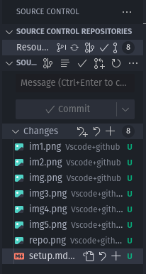

# Setup vs code and github(on linux)

- Download the .deb package(if you are using linux mint or ubuntu or pop os or debian or any debian or ubuntu based distro) or the .rpm package(in case of fedora or open suse) . download the x64 package on a newer syetem(<=4yrs old) or on VM on mac download the arm64 version 

[pic](img.png)

- Usually if you open the file manager and locate the .deb vscode package  usually at "Downloads directory"  and then double click the file a pop up will ask you if you want to install the package , follow the on screen instructions and proceed further 
Manually install by running the command in a terminal (without the quotes)
"sudo apt install ./Downloads/'package_name_you_downloaded'.deb

- Now open vs code and follow the on screen instructions until you reach "sync settings" or "Settings sync"
click on sign in when that dialog box appears and sign in using your "github" credentials on the new browser windows that pops up , follow the on screen instructions and wait until you do not get the cancel settings sync pop up whenver you try to open a new file in the current instance of vs code. 

- now follow this [video](https://www.youtube.com/watch?v=8X4u9sca3Io) and setup a ssh key for your device and add it to github.
If you get any issues at this step raise them at the issues of this repo 

- Download roughly these extensions

[img1](im1.png)
[img2](im2.png)
[img3](img3.png)
[img4](img4.png)
[img5](img5.png)

( I dont remeber what extensions are needed to setup github because its been too long since i've done it)
filter out whatever extensions you dont need based on your needs 

- with that you can now clone a repo and start doing your work in vs code and whenever you feel the need to sync the current status of the code or files in you local folder sycned with the repo click on this icon [repo](repo.png)

When you click on that icon u will have a dialog box , to commit hover over the chnages section of the dialog box and click on the plus icon to add the files to staging area 

Then click on commit button to commit the changes 

For more detailed explanation on how git works check this video 
[link](https://www.youtube.com/watch?v=apGV9Kg7ics&pp=ygUTa3VuYWwga3VzaHdhaGEgZ2l0IA%3D%3D)

